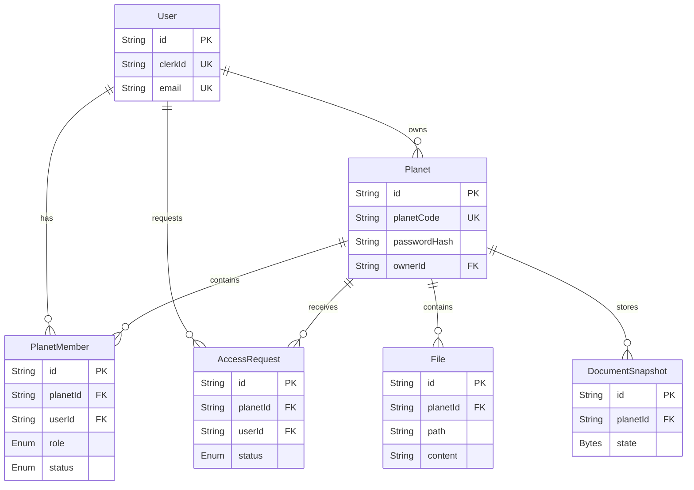

# Database Design

## 1. Overview
The database uses PostgreSQL managed via Prisma. It stores users, planets, memberships, files, and Yjs document snapshots.

## 2. ER Diagram

## 3. Key Models & Constraints
- **User:** Maps `clerkId` to a local `id`.
- **Planet:** Contains the bcrypt `passwordHash`.
- **PlanetMember:** Enforces a unique constraint on `(planetId, userId)`. `status` (ACTIVE/REMOVED) dictates access.
- **AccessRequest:** Enforces a unique constraint on `(planetId, userId)` for pending requests.
- **File:** Enforces a unique constraint on `(planetId, path)` to prevent duplicate paths.
- **DocumentSnapshot:** Stores the binary `Y.encodeStateAsUpdate()` payload for persistence.
